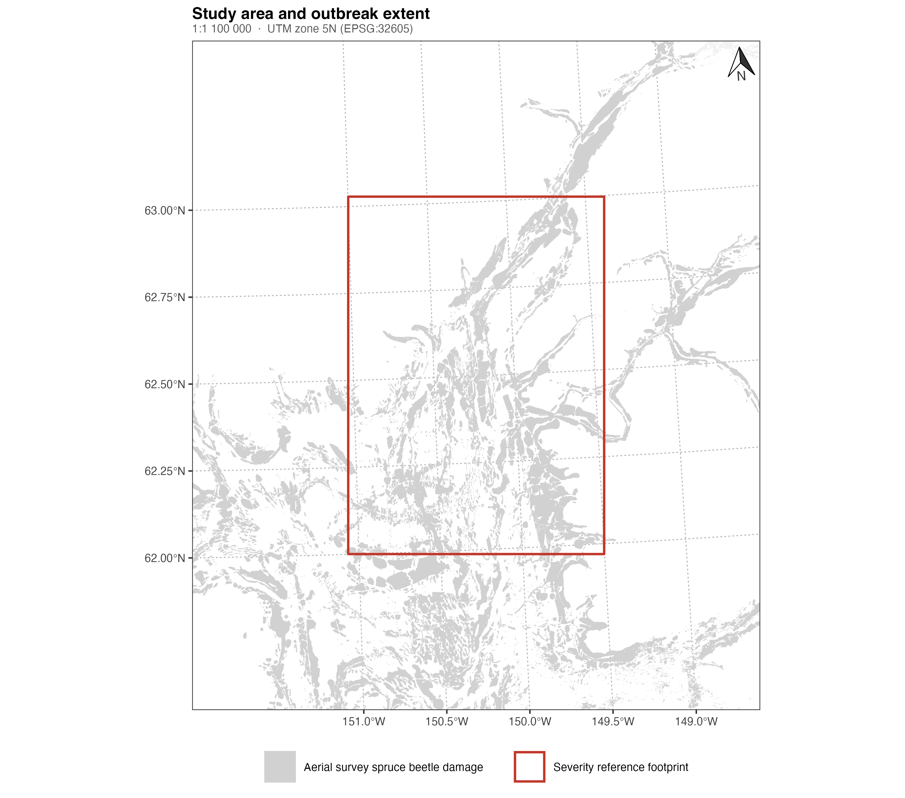

# Performance of deep learning methods and open satellite time series in detecting low-severity spruce beetle mortality in Southcentral Alaska

## Abstract

Spruce beetle (*Dendroctonus rufipennis*) has killed spruce across Southcentral Alaska since about 2016, yet roughly ninety percent of the mortality sits in stands of areal severity below 0.05, beneath the detection floor of conventional Landsat change analysis, and the aerial survey record understates exactly this dispersed, low-severity damage. We test whether temporal deep learning on freely available satellite time series lowers that floor. Annual Sentinel-2 composites, cloud-screened with Cloud Score+ quality mosaics on a 90 m stand grid, feed subsequence models, a temporal convolutional network and a Transformer encoder, trained on dead-spruce crowns digitised from statewide sub-metre image mosaics of 2020 and 2023; comparison of the two epochs supplies interval-censored mortality-onset labels, verified pre-mortality trajectories and a cross-epoch consistency check on the labels themselves. Models are benchmarked against the pre- to post-outbreak shortwave-infrared reflectance change that defines the current floor, under block spatial cross-validation, with skill reported per severity stratum and evaluated independently against a published high-resolution severity product whose footprint no training fold touches. Quantitative results are pending execution of the pre-registered analysis: detection skill in the 0.01 to 0.10 stratum, the detectability floor per method, onset-dating error under interval supervision, and correspondence of the reconstructed 2016 to 2025 outbreak progression with the aerial survey record. The severity strata, metrics and decision rules are fixed by pre-registration before outcome data are analysed.

## Figures

Figure 1. Study area in Southcentral Alaska: aerial detection survey records of spruce beetle damage, 2016 to 2025, and the footprint of the independent severity reference. UTM zone 5N; graticule in WGS 84.

## Tables

Tables render live in `01.manuscript/manuscript.qmd`; results tables carry their final structure with values pending the pre-registered analysis.

1. Input datasets, their roles, and access terms.
2. Assembled annual Sentinel-2 composites on the 90 m reference grid, with per-cell clear-observation density.
3. Severity estimation error per severity stratum and model (RMSE, relative RMSE, MAE, Theil's U with decomposition), from block spatial cross-validation. Pending.
4. Detection skill per severity stratum and model: user's accuracy, producer's accuracy, recall at 0.90 precision. Pending.
5. Test of the primary hypothesis in the 0.01 to 0.10 severity stratum: paired difference against the SWIR change baseline, bootstrap confidence interval, Wilcoxon and McNemar tests, resulting detectability floor. Pending.
6. Onset-year estimation error by model and supervision regime, testing the interval-supervision hypothesis. Pending.
7. Agreement with the independent severity reference at 90 m and 30 m support. Pending.
8. Reconstructed annual outbreak area against aerial survey extent, 2016 to 2025. Pending.

## Reproduction

The manuscript is executable: every number and figure is computed at render time from `01.manuscript/manuscript.qmd`. Inputs are retrieved by `05.scripts/00_download_inputs.sh` and verified by `05.scripts/01_verify_inputs.R`; all input data are open sources documented in `02.inputs/README.md`.
